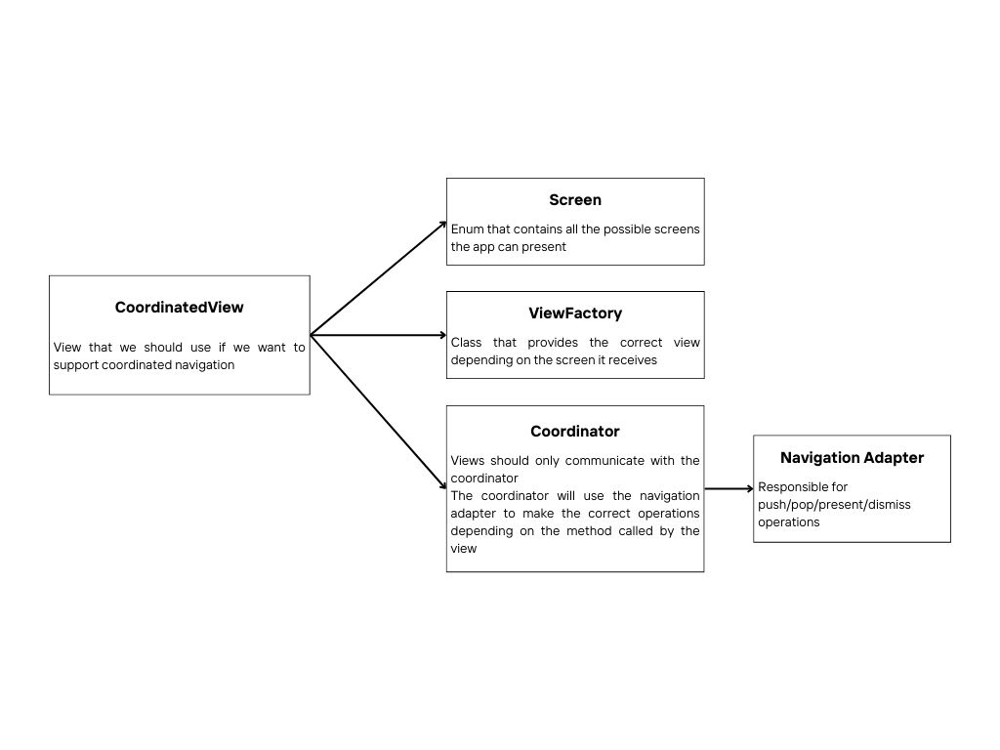
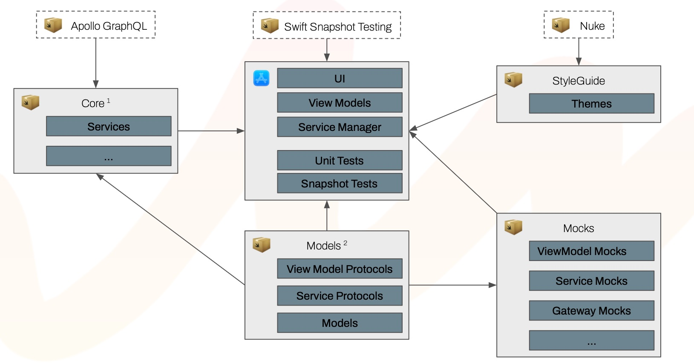

# Alfie Native iOS Application 

This is a repository for an e-commerce iOS app template. Its current behavior can be seen in the following demonstration:

<video src="Docs/alfie-demo.mp4" alt="Video demonstration of the Alfie app usage"></video>

---

## Prerequisites

This project uses a mock GraphQL API for fetching data. Mock server can be run locally as decribed in documentation: https://github.com/Mindera/Alfie-Mocks

## Architecture 

### Model 

Represents the data we'll use in our application. It is the result of the network requests used to feed our application with content.

```
public struct ProductListing {
    public struct Pagination {
        /// Start point
        public let offset: Int
        /// Records to return
        public let limit: Int
        /// The total number of results
        public let total: Int
        /// Number of pages based on offset
        public let pages: Int
        /// Current page
        public let page: Int
        /// Offset of next page if page exists
        public let nextPage: Int?
        /// Offset of previous page if page exists
        public let previousPage: Int?

        public init(offset: Int,
                    limit: Int,
                    total: Int,
                    pages: Int,
                    page: Int,
                    nextPage: Int? = nil,
                    previousPage: Int? = nil) {
            self.offset = offset
            self.limit = limit
            self.total = total
            self.pages = pages
            self.page = page
            self.nextPage = nextPage
            self.previousPage = previousPage
        }
    }

    public let title: String
    public let pagination: Pagination
    public let products: [Product]

    public init(title: String,
                pagination: Pagination,
                products: [Product]) {
        self.title = title
        self.pagination = pagination
        self.products = products
    }
}
```

### View

- The view layer in this codebase is done in **SwiftUI** and some components in **UIKit**
- We can use a **SwiftUI** navigation framework to help us with navigation. When creating the view, use the environment object coordinator of type `Coordinator` to access navigation features
- Every *view* should have a *viewModel* that will handle necessary business logic needed to show the content to the user

```
import SwiftUI

struct FeatureView<ViewModel: FeatureViewModelProtocol>: View {
    @EnvironmentObject private var coordinator: Coordinator
    @StateObject private var viewModel: ViewModel

    init(viewModel: ViewModel) {
        self._viewModel = StateObject(wrappedValue: viewModel)
    }

    var body: some View {
        switch viewModel.state {
            case .loading:
                LoaderView(circleDiameter: .defaultSmall)
            case .success:
                Text("Success")
            case .error:
                Text("Error")
            case .empty:
                EmptyView()
        }
    }
}
```

### ViewModel 

- Observable object, that will trigger updates in the view 
- A state pattern is used to provide the view the info on which screen to render 
- The *success* state should be visible after a successful network request, that will provide the datasource to the view 
- A viewModel protocol is used to make it easier to mock viewModels for the snapshot tests 
    
```
enum FeatureState {
    case loading
    case success(results: [String])
    case error
    case empty
}

protocol FeatureViewModelProtocol: ObservableObject {
    var state: FeatureState { get }
}

final class FeatureViewModel: FeatureViewModelProtocol {
    private let dependencyContainer: FeatureDependencyContainerProtocol
    @Published var state: FeatureState

    init(dependencyContainer: FeatureDependencyContainerProtocol) {
        self.dependencyContainer = dependencyContainer
        state = .success(["Australia", "Portugal", "UnitedKingdom"])
    }
}

```

### DependencyContainer 

- `ViewModel` helper 
- Filters the dependencies present in the `ServiceProvider` so that the viewModel only uses what it needs 
    
```
protocol FeatureDependencyContainerProtocol {
    var deepLinkService: DeepLinkServiceProtocol { get }
    var webUrlProvider: WebURLProviderProtocol { get }
}

final class FeatureDependencyContainer: FeatureDependencyContainerProtocol {
    init(deepLinkService: DeepLinkServiceProtocol, 
         webUrlProvider: WebURLProviderProtocol) {
        self.deepLinkService = deepLinkService
        self.webUrlProvider = webUrlProvider
    }
}
```

### Navigation 

The navigation approach in our project contains five main components: `CoordinatedView`, `Coordinator`, `Screen`, `ViewFactory` and the `NavigationAdapter`.



#### Navigation Adapter 

- Wrapper around the navigation functionality of SwiftUI 
- Provides an API with methods like *push*, *pop*, *presentSheet*, *presentFullScreen* etc.
- This approach tries to mimic an UIKit way of navigating the app 

#### Coordinated View 

- Object that initialises a navigation path with a root View 
- In order to create this object we need to provide a `Coordinator` and a `ViewFactory`
- In theory we won't have deal with this object other than creating it in the `TabScreen`

#### Coordinator 

- This is the object that views will access to trigger some kind of navigation operation 
- The responsability of where we should navigate to should be unknown to the view 
- The coordinator should have methods like *didTapBackButton* that would use the `NavigationAdapter` to navigate to the correct view 

```
final class Coordinator: ObservableObject, CoordinatorProtocol {
    let navigationAdapter: NavigationAdapter<Screen>

    init(navigationAdapter: NavigationAdapter<Screen>) {
        self.navigationAdapter = navigationAdapter
    }

    // MARK: - Public

    public func didTapBackButton() {
        navigationAdapter.pop()
    }

    public func popToRoot() {
        navigationAdapter.popToRoot()
    }

    public func openAccount() {
        navigationAdapter.push(.account)
    }
}
```

#### ViewFactory 

- The view factory goal is to create the views and provide them to the `CoordinatedView` 
- We only have to worry about the creation of the view with the respective *viewModels* and *dependencyContainers*
- It uses the *screen* enum to decide which view to return
- The *serviceProvider* will be injected in this class in order do create the dependencies

```
final class ViewFactory: ViewFactoryProtocol {
    @ViewBuilder
    func view(for screen: Screen) -> some View {
        switch screen {
            case .tab(let tab):
                switch tab {
                    case .home:
                        HomeView()
                    case .shop:
                        ShopView()
                    case .bag:
                        BagView()
                    
                }
            case .wishlist:
                WishlistView()
            case .account:
                AccountView()
            case .search:
                SearchView()
            case .debugMenu:
                DebugMenuView()
        }
    }
}
```

#### Screen 

- Enum that contains all the paths that the navigation can take 
- Each case in the enum will be associated with a returned view in the `ViewFactory`

```
enum Screen: ScreenProtocol {
    case tab(_ tab: TabScreen)
    case wishlist
    case account
    case search
    case debugMenu

    var id: Screen {
        self
    }
}
```

### Services 

- A `Core` package was created to include all the necessary services for the app to work 
- `GraphQL` and `REST services` should be included in this package but not in the app 
    


### Style Guide

- Theme default values and rules should be defined in the `StyleGuide` package, including *colors*, *spacings*, *shapes*, *fonts*, *icons*, *animation types* etc.
- Reusable components such as *buttons*, *loaders*, among others, should also be implemented in this package.

---

## Localisation

This project uses [Apple String Catalog](https://developer.apple.com/documentation/xcode/localizing-and-varying-text-with-a-string-catalog). It requires iOS 16 which brings a new way to localise strings with `LocalizedStringResource`. 

It is possible to initialise a localised string or a localised attributed string from a `LocalizedStringResource` beforehand or keep it to localise later when needed. The later approach enables having dynamic localisation on SwiftUI Previews by injecting different environment locales, while initialising a localised string/attributed string beforehand disables the ability to automatic lookup for a localisable resource in a different language.

Part of the localisation infrastructure is a property wrapper `L10n.Resource` which provides a wrapped `LocalizedStringResource` and also a *projectedValue* with a localized String type for interoperability purposes. Use $(dollar sign) before the property name to access it.

Some instructions outlined below.

#### How to use

1. Open the String Catalog table `L10n`.
2. **Manually** add the entries in the base language and any other languages. Please use `ReverseDomain` convention along with `SnakeCase` convention for keys naming (ex: `plp.error_view.title`) and give translation keys meaningful names.
3. *Mark for Review* any entry not officially provided/approved to easily track the translations state (*Mark as Reviewed* when this happens too)
4. Add the required nested enumeration `Keys` in `L10n+Keys` file with a case for each entry added in the step 2. Please group it using a `// MARK -` comment per feature or scope and order alphabetically by key name.
5. Add the required `@Resource` variables in `L10n+Resources` file for each key added in the step 4. Please group it using a `// MARK -` comment per feature or scope and order alphabetically by key name.
6. To handle entries with arguments (*%d*, *%@*) specify a dedicated function for each entry. In an edge case of having very complex text copy to manage this way, not following this approach leads to get the literal string with the wildcards and you can still use String(format:) with variadic parameters as fallback.

**Note:** New tables are discouraged, the goal is to have everything in the `L10n` table.

**Sample**

```
// L10n+Resources.swift
extension L10n {

	...
	
	// MARK: - Home Screen

	static func homeScreenLoggedInSubtitleWithParameter(registrationYear: String) -> String {
		LocalizableResource<Self>(.homeScreenLoggedInSubtitle, arguments: registrationYear).projectedValue
	}

	@LocalizableResource<Self>(.homeScreenTitle) static var homeScreenTitle
}

// L10n+Keys.swift
extension L10n {
	enum Keys: String, RawRepresentable, CaseIterable {
	
		...
		
		// MARK: - Home Screen
		
		case homeScreenLoggedInSubtitle = "home.screen.logged_in.subtitle"
		case homeScreenTitle = "home.screen.title"
	}
}

...SwiftUI...
Text(L10n.homeScreenTitle)
Text(L10n.$homeScreenTitle)
Text(L10n.homeScreenLoggedInSubtitleWithParameter(registrationYear: "\(memberSince)"))

```

#### How to test

**LocalizationTests** contains some tests that already handle the supported languages.
If for some specific reason you have created a new table, you should include in *testLocalizationTables* test that will go through all the keys and validate translations are in place for all supported languages.
Regarding testing localisation with arguments it's recommended to create a test to validate each variation (pluralization, devices, etc.) you may need to customize.

For example for the copy *bagProductDescription* below with pluralization, a test *testLocalizableBagWithArgs* could be designed to lookup for each variation:
- *Zero*: Your bag is empty!
- *One*: Your bag has a single product!
- *Other*: You've %d products in your bag!

```
    func testLocalizableBagWithArgs() {
    	localizations.forEach { localization in
            let resources = [0, 1, 2].map { L10n.bagProductDescription(numberOfProducts: $0) }
            XCTAssertTrue(validateLocalizedStrings(resources, for: localization))
        }
    }
```

---

## GraphQL

This project uses GraphQL for fetching data from the BFF API. Data is fetched using queries defined by us that return models mapping the API as defined by our queries. The main advantage is that we can add or remove fields or change the returned data without requiring any changes on the API side, as long as we ask fields and data available within the defined schema.

#### How to add a new query

If a new feature being developed requires us to add a new query to fetch data from the BFF API, we need to:

1. Create a new folder in `Packages/Core/Sources/GraphQL/Queries/<Feature>`
2. Add a `Queries.graphql` file in that folder and add the query or queries you need (use existing queries as examples if necessary)
3. It is recommended to use fragments to describe the returned models, so if possible define them and add them to a `Fragments` folder as `<Model>Fragment.graphql` files
4. Update the schema by adding a `schema-<feature>.graphqls` file to `Packages/Core/Sources/GraphQL/Schema`
5. The schema file you add should extend the `Query` type with the new query or queries and also add all the new types necessary for the feature
6. Open the terminal app, cd to `Packages/Core` and run `./apollo-ios-cli generate` 
7. Confirm that new query objects, new models and respective mocks were added to the repository
8. Create the local models that the app will use for the feature in the `Models` package, mapping the BFF models as required
9. In `Packages/Core/Sources/Services/BFFService/Converters` add the necessary converter extensions to convert BFF models into the newly created local models
10. Add the fetch method for the new query in the `BFFClientService` instance, including the conversion to the internal models;

#### How to update a query

If a new field is required or no longer necessary for an existing feature, we need to:

1. Update the corresponding query to add / remove the field (or just update the fragment if that's the case)
2. Run the generate command as described in step 6 above
3. Update the local model and / or the conversion methods

---

## CI/CD

**Work in progress**

---

## Release

**Work in progress**

---
